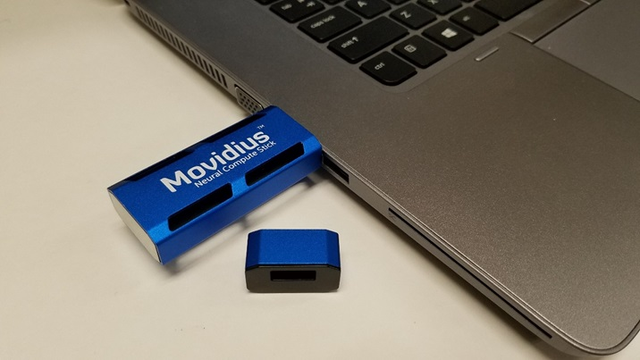

# Installation and Configuration
This page provides installation and configuration information needed to use the Intel® Movidius™ Neural Compute Stick (Intel® Movidius™ NCS) and the examples provided in this repository. To use the Intel Movidius NCS, you will need to have the Intel Movidius Neural Compute SDK installed on your development computer. The SDK installation provides an option to install the examples in this repository. If you've already installed the SDK on your development computer, you may have selected the option to also install these examples. If you have not already installed the SDK, you should follow the instructions in the Installation of SDK and Examples section on this page. When prompted, select the option to install the examples. 

## Prerequisites
To build and run the examples in this repository, you will need to have the following:
- Intel Movidius Neural Compute Stick
- Intel Movidius Neural Compute SDK 
- Development computer with supported OS 
  - x86-64 with Ubuntu (64 bit) 16.04 Desktop 
  - Raspberry Pi 3 with Raspian Stretch (starting with SDK 1.09.xx)
    - See [Upgrade Raspian Jessie to Stretch](https://linuxconfig.org/how-to-upgrade-debian-8-jessie-to-debian-9-stretch) 
  - Virtual Machine per the [supported VM configuration](VirtualMachineConfig.md)
- Internet connection
- USB camera (optional)

## Connecting the Intel Movidius NCS to a Development Computer
The Intel Movidius NCS connects to the development computer over a USB 2.0 High Speed interface. Plug the Intel Movidius NCS directly to a USB port on your development computer or into a powered USB hub that is plugged into your development computer.



## Installation of SDK and Examples
To install the SDK along with the examples in this repository, use the following command on your development computer. This is the typical installation. If your development machine already has caffe installed see the note below.  If you haven't already installed the SDK on your development computer, you should use this command to install:
```
git clone http://github.com/Movidius/ncsdk && cd ncsdk && make install && make examples
```
<strong>Note:</strong> if you are installing on a machine that already has caffe installed and it's directory is already in the PYTHONPATH environment variable you will need to manually remove the existing directory from the PYTHONPATH environment variable prior to installing the ncsdk.  Also, you will need to manually adjust the PYTHONPATH to match your development needs such that it points to the caffe version installed with the NCSDK when using the NCSDK, and it points to other caffe versions when using those.

<strong>Note:</strong> The installation will only set the PYTHONPATH environment variable for the current user.  It will do so by modifying the .bashrc file for that user.  To use the sdk as other users on the machine you will need to manually set the PYTHONPATH for those other users.

## Installation of Examples without SDK
To install only the examples and not the SDK on your development computer, use the following command to clone the repository and then make appropriate examples for your development computer. If you already have the SDK installed and only need the examples on your machine, you should use this command to install the examples:
```
git clone http://github.com/Movidius/ncsdk && cd ncsdk && make examples
```

## Building Individual Examples
Whether installing with the SDK or without it, both methods above will install and build the examples that are appropriate for your development system, including prerequisite software. Each example comes with its own Makefile that will install only that specific example and any prerequisites that it requires. To install and build any individual example, run the 'make' command from within that example's base directory. For example, to build the GoogLeNet examples, type the following command:

```
cd examples/Caffe/GoogLeNet && make

```

The Makefile for each example also has a 'help' target that will display all possible targets. To see all possible targets for any example, use the following command from within the examples top directory:
```
make help

```

## Uninstallation 
To uninstall the SDK, type the following command:
```
make uninstall

```

## Installation Manifest
For the list of files that 'make install' will modify on your system (outside of the repository), see the [installation manifest](manifest.md). 
