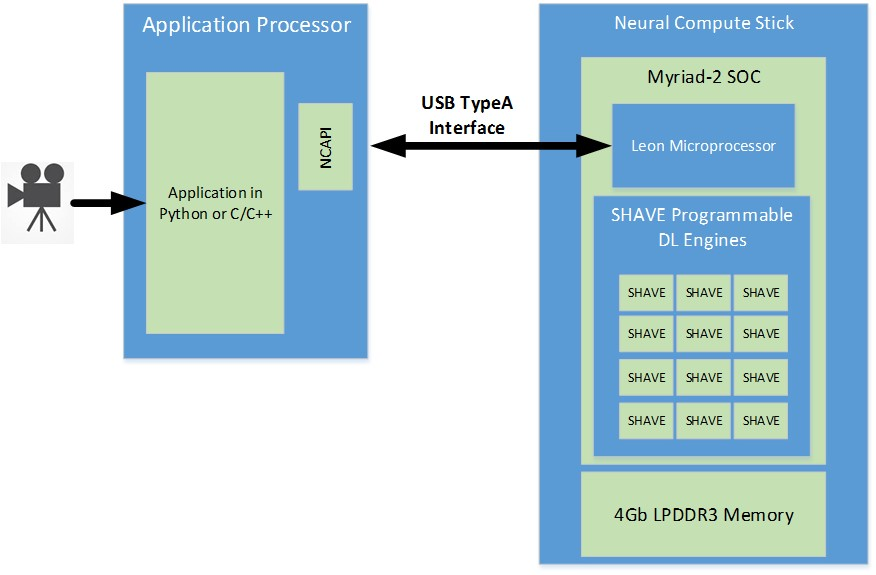

# Introduction

The Neural Compute SDK works on compiling and executing a given Caffe or TensorFlow™ Neural Network on the Intel® Movidius™ Neural Compute Stick (Intel® Movidius™ NCS). Read on for a detailed explanation.

# Architecture Details
The following diagram shows the inner workings of the Intel Movidius NCS. The Intel Movidius NCS primarily contains the Intel® Movidius™ Myriad™ 2 vision processing unit (VPU) and some power delivery voltage regulators. The Intel Movidius Myriad 2 VPU includes 4 Gbit of LPDDR3 DRAM, and its architecture includes specific imaging and vision accelerators and an array of 12 VLIW vector processors called SHAVE processors. These processors are used to accelerate neural networks by running parts of the neural networks in parallel for achieving the highest performance. The Intel Movidius NCS is connected to an application processor (AP), such as a Raspberry Pi or UP Squared board, using the USB interface on the Intel Movidius Myriad 2 VPU. The USB3 interface can be used both in Super Speed (5 Gbps) or High Speed (480 Mbps) modes.

The CPU in the Intel Movidius Myriad 2 VPU is a SPARC microprocessor core that runs custom firmware. When the Intel Movidius Neural Compute Stick is first plugged in, there is no firmware loaded onto it. The Intel Movidius Myriad 2 VPU boots from the internal ROM and connects to the host computer (application processor) as a USB 2.0 device.

Applications executing on the host computer (AP) communicate to the Intel Movidius Myriad VPU SOC using the Neural Compute API. When the API initializes and opens a device, the firmware from the Neural Compute SDK is loaded onto the Intel Movidius Neural Compute Stick. At this time, the Intel Movidius NCS resets and now shows up to the host computer as a USB 2.0 or USB 3.0 device depending on the host type. It is now ready to accept the neural network graph files and commands to execute inferences on the graph files.

A graph file is loaded into the DRAM attached to the Intel Movidius Myriad 2 VPU via the API. The LEON processor coordinates receiving the graph file and images for inference via the USB connection. It also parses the graph file and schedules kernels to the SHAVE neural compute accelerator engines. In addition, the LEON processor also takes care of monitoring die temperature and throttling processing on high temperature alerts. Statistics and the output of the neural network are sent back to the host computer via the USB connection, and they are received by a host application via the API.

In addition to the API, the NCSDK provides the tools mvNCCompile, mvNCCheck, and mvNCProfile that run on the host computer during application and neural network development. The checker and profiler tools run an inference on the Intel Movidius Neural Compute Stick to validate against Caffe/TensorFlow and generate per layer statistics respectively.
