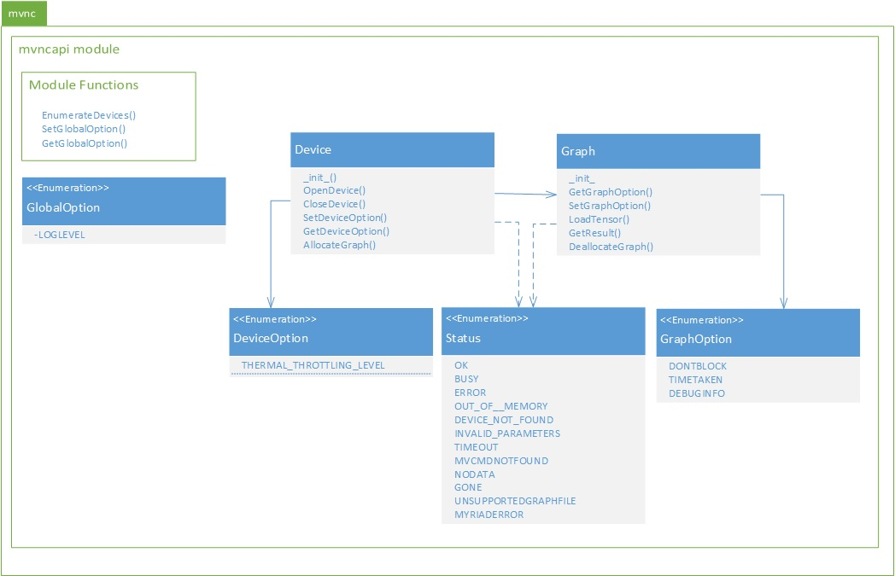

# Movidius™ Neural Compute SDK Python API

The SDK comes with a Python3 Language API that enables applications that utilize hardware accelerated Deep Neural Networks via the Movidius™ Neural Compute Stick (NCS.)  The API is provided as a single python script (mvncapi.py) which is placed on the development computer when the SDK is installed.  Details of the Python API are provided below and within the documents linked from here. 

## Class Diagram
The Python class diagram follows.  In this diagram it is shown that the entire python api is in the mvnc Python package.  Within the mvnc package there is one Python module which is mvncapi.  The mvncapi module is defined by the contents of the mvncapi.py file.

In the sections that follow, the details of the elements within the mvncapi module are provided.  This includes module level enumerations, functions that are global to the module, and the classes defined in the module. 

## Enumerations
### [GlobalOption](GlobalOption.md)
### [DeviceOption](DeviceOption.md)
### [GraphOption](GraphOption.md)
### [Status](Status.md)

## Global Functions
### [EnumerateDevices](EnumerateDevices.md)
### [SetGlobalOption](SetGlobalOption.md)
### [GetGlobalOption](GetGlobalOption.md)

## Classes
### [Device](Device.md)
### [Graph](Graph.md)

