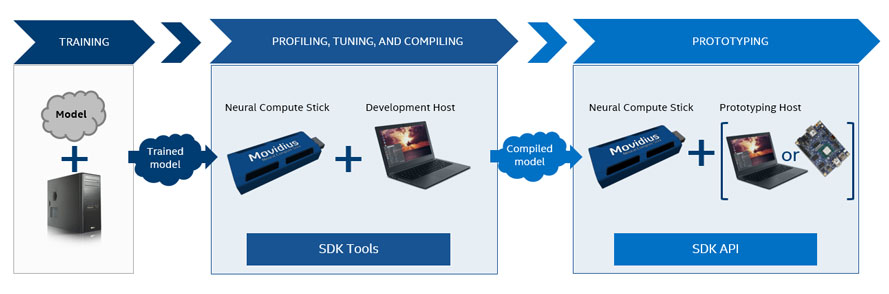

<a name="Introduction"></a>
# Introduction 
The Intel® Movidius™ Neural Compute SDK (NCSDK) and Intel® Movidius™ Neural Compute Stick (Intel® Movidius™ NCS) enable rapid prototyping, validation, and deployment of deep neural networks (DNNs).

The NCS is used in two primary scenarios:
- Profiling, tuning, and compiling a DNN on a development computer (host system) with the tools provided in the Intel Movidius Neural Compute SDK. In this scenario, the host system is typically a desktop or laptop machine running Ubuntu 16.04 desktop (x86, 64 bit), but you can use any supported platform for these steps.

- Prototyping a user application on a development computer (host system), which accesses the hardware of the Intel Movidius NCS to accelerate DNN inferences via the API provided with the Intel Movidius Neural Compute SDK. In this scenario, the host system can be a developer workstation or any developer system that runs an operating system compatible with the API. 

The following diagram shows the typical workflow for development with the Intel Movidius NCS:


The training phase does not utilize the Intel Movidius NCS hardware or NCSDK, while the subsequent phases of “profiling, tuning, and compiling” and “prototyping” do require the Intel Movidius NCS hardware and the accompanying Intel Movidius Neural Compute SDK.

The NCSDK contains a set of software tools to compile, profile, and check validity of your DNN as well as an API for both the C and Python programming languages. The API is provided to allow users to create software that offloads the neural network computation onto the Intel Movidius Neural Compute Stick.

The following is more information on the [architecture](ncs1arch.md) of the Intel Movidius Neural Compute Stick:

<a name="Frameworks"></a>
# Frameworks
Neural Compute SDK currently supports two Deep Learning frameworks.
1. [Caffe](Caffe.md): Caffe is a deep learning framework from Berkeley Vision Labs.
2. [TensorFlow™](TensorFlow.md): TensorFlow™ is a deep learning framework from Google.

[See how to use networks from these supported frameworks with Intel Movidius NCS.](configure_network.md)


<a name="InstallAndExamples"></a>
# Installation and Examples 
The following commands install NCSDK and run examples. Detailed instructions for [installation and configuration](install.md):

```
git clone http://github.com/Movidius/ncsdk && cd ncsdk && make install && make examples

```
<a name="NcSdkTools"></a>
# Intel® Movidius™ Neural Compute SDK Tools
The SDK comes with a set of tools to assist in development and deployment of applications that utilize hardware accelerated Deep Neural Networks via the Intel Movidius Neural Compute Stick. Each tool and its usage is described below:

* [mvNCCompile](tools/compile.md): Converts Caffe/TF network and weights to Intel Movidius technology internal compiled format

* [mvNCProfile](tools/profile.md): Provides layer-by-layer statistics to evaluate the performance of Caffe/TF networks on the NCS

* [mvNCCheck](tools/check.md): Compares the results from an inference by running the network on the NCS and Caffe/TF

<a name="NcApi"></a>
# Neural Compute API
Applications for inferencing with Neural Compute SDK can be developed either in C/C++ or Python. The API provides a software interface to Open/Close Neural Compute Sticks, load graphs into the Intel Movidius NCS, and run inferences on the stick.

* [C API](c_api/readme.md)
* [Python API](py_api/readme.md)

<a name="UserForum"></a>
# Intel® Movidius™ Neural Compute Stick User Forum

There is an active user forum in which users of the Intel Movidius Neural Compute Stick discuss ideas and issues they have with regard to the Intel Movidius NCS. Access the Intel Movidius NCS User Forum with the following link:

[https://ncsforum.movidius.com](https://ncsforum.movidius.com)

The forum is a good place to go if you need help troubleshooting an issue. You may find other people who have figured out the issue, or get ideas for how to fix it. The forum is also monitored by Intel Movidius product engineers who provide solutions, as well.

<a name="Examples"></a>
# Examples

There are several examples, including the following at GitHub:
* Caffe
  * GoogLeNet
  * AlexNet
  * SqueezeNet
* TensorFlow™
  * Inception V1
  * Inception V3
* Apps
  * hello_ncs_py
  * hello_ncs_cpp
  * multistick_cpp

The examples demonstrate compiling, profiling, and running inferences using the network on the Intel Movidius Neural Compute Stick.
Each example contains a Makefile. Running 'make help' in the example's base directory will give possible make targets.

```

git clone http://github.com/Movidius/ncsdk # Already done during installation
(cd ncsdk/examples && make) # run all examples
(cd ncsdk/examples/caffe/GoogLeNet && make) # Run just one example

```

<a name="AppZoo"></a>
# Neural Compute App Zoo
The Neural Compute App Zoo is a GitHub repository at [http://github.com/Movidius/ncappzoo](http://github.com/Movidius/ncappzoo), which is designed for developers to contribute networks and applications written for the Intel Movidus Neural Compute Stick to the Intel Movidius NCS community.

See [The Neural Compute App Zoo README](https://github.com/Movidius/ncappzoo/blob/master/README.md) for more information.

<a name="TroubleShooting"></a>
# Troubleshooting and Tech Support
Be sure to check the [NCS Troubleshooting Guide](https://ncsforum.movidius.com/discussion/370/intel-ncs-troubleshooting-help-and-guidelines#latest) if you run into any issues with the NCS or NCSDK.

Also for general tech support issues the [NCS User Forum](https://developer.movidius.com/forums) is recommended and contains community discussions on many issues and resolutions.

<a name="ReleaseNotes"></a>
# Release Notes
See the latests [Release Notes](release_notes.md) for detailed information of the specific release.
