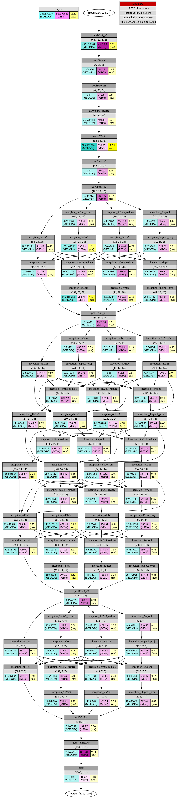

# mvNCProfile

Type|Function
------------ | -------------
Library|Command Line Tools
Output|Profile Data in HTML/graphic/Text Format
Revision|1.08
See also| [mvNCCompile](compile.md), [mvNCCheck](check.md), [TensorFlow™ info](../TensorFlow.md)

## Overview
This command line tool compiles the provided network, runs the network on the connected Intel® Movidius™ Neural Compute Stick (Intel® Movidius™ NCS) and creates a text/HTML profiling output. The profiling data contains layer-by-layer stats about the performance of the input network. This is very helpful in determining how much time is spent on each layer, and is helpful in determining changes to the network to improve the total inference time for a network on the Intel Movidius NCS.

The weights file is not required when profiling a network to determine bottlenecks.

## Syntax

### Caffe
```bash
mvNCProfile network.prototxt [-w weights_file] [-s Max Number of Shaves] [-in Input Node Name] [-on Output Node Name] [-is Input-Width Input-Height] [-o Output Graph Filename]
```
### TensorFlow™
```bash
mvNCProfile network.meta [-s Max Number of Shaves] [-in Input Node Name] [-on Output Node Name] [-is Input-Width Input-Height] [-o Output Graph Filename]
```

Argument|Description
------------ | -------------
network.prototxt(caffe)<br>network.meta(TensorFlow™)|Name of the network file. 
[-w weights_file]|Weights filename from training. (Only applies to Caffe, not to be used with TensorFlow™.) If omitted, zero weights will be used. 
[-s Max # of Shaves]|Default: 1<br><br>Selects the maximum number of SHAVEs (1,2,4,8, or 12.) to use for network layers.<br><br>Note: The NCS runtime code may use less than the MAX SHAVE value for some layers where measurements have typically shown no inference performance degradation (and consequently a power benefit) of using fewer SHAVEs.
[-in Input Node Name]|By default the network is processed from the input tensor. This option allows a user to select an alternative start point in the network.<br><br>This enables partial network processing. When used together with the -on option a user can isolate one or more layers in a network for analysis.
[-on Output Node Name]|By default the network is processed through to the output tensor. This option allows a user to select an alternative end point in the network.<br><br>This enables partial network processing. When used together with the -in option, a user can isolate one or more layers in a network for analysis.
[-is Input-Width Input-Height]|Input size is typically described as a part of the network. For networks that do not have dimension constraints on the input tensor, this option can be used to set the desired input dimensions.<br><br>Only two dimensions are defined because the batch size is always 1 and the number of color planes is assumed to be 3.
[-o Output Graph Filename]|Default: "graph"<br><br>Output graph container filename. If not provided, “graph” will be used.


## Known Issues
- The -o option is yet to be implemented.
- the -w option can be omitted if the network's .caffemodel file has the same base filename as the .prototxt file it will be used.

## Example
### Caffe
```bash

mvNCProfile deploy.prototxt -w bvlc_googlenet.caffemodel -s 12 -in input -on prob -is 224 224 -o GoogLeNet.graph

```
### TensorFlow™
```bash

mvNCProfile inception_v1.meta -s 12 -in=input -on=InceptionV1/Logits/Predictions/Reshape_1 -is 224 224 -o InceptionV1.graph

```

# Profile Output for GoogLeNet

## Text Format
The console output from mvNCProfile is shown below.
```
Detailed Per Layer Profile
Layer      Name                                 MFLOPs    Bandwidth MB/s        time(ms)
========================================================================================
0          conv1/7x7_s2                        236.028           2505.00            5.63
1          pool1/3x3_s2                          1.806           1441.66            1.06
2          pool1/norm1                           0.000            712.67            0.54
3          conv2/3x3_reduce                     25.690            404.11            0.97
4          conv2/3x3                           693.633            316.67           11.55
5          conv2/norm2                           0.000            797.05            1.44
6          pool2/3x3_s2                          1.355           1495.52            0.77
7          inception_3a/1x1                     19.268            462.47            0.67
8          inception_3a/3x3_reduce              28.901            399.64            0.81
9          inception_3a/3x3                    173.408            333.13            4.52
10         inception_3a/5x5_reduce               4.817            793.78            0.37
11         inception_3a/5x5                     20.070            849.91            0.73
12         inception_3a/pool                     1.355            686.68            0.42
13         inception_3a/pool_proj                9.634            558.60            0.54
14         inception_3b/1x1                     51.380            470.46            0.95
15         inception_3b/3x3_reduce              51.380            472.93            0.94
16         inception_3b/3x3                    346.817            268.78            7.99
17         inception_3b/5x5_reduce              12.845           1098.70            0.36
18         inception_3b/5x5                    120.422            580.92            2.32
19         inception_3b/pool                     1.806            695.31            0.55
20         inception_3b/pool_proj               25.690            683.06            0.61
21         pool3/3x3_s2                          0.847           1305.34            0.55
22         inception_4a/1x1                     36.127            374.89            0.95
23         inception_4a/3x3_reduce              18.063            574.14            0.47
24         inception_4a/3x3                     70.447            320.50            2.09
25         inception_4a/5x5_reduce               3.011           1034.04            0.19
26         inception_4a/5x5                      7.526            616.84            0.31
27         inception_4a/pool                     0.847            630.87            0.28
28         inception_4a/pool_proj               12.042            661.36            0.36
29         inception_4b/1x1                     32.113            294.21            1.18
30         inception_4b/3x3_reduce              22.479            377.09            0.80
31         inception_4b/3x3                     88.510            313.94            2.58
32         inception_4b/5x5_reduce               4.817            838.52            0.26
33         inception_4b/5x5                     15.053            384.82            0.78
34         inception_4b/pool                     0.903            612.12            0.31
35         inception_4b/pool_proj               12.845            552.44            0.46
36         inception_4c/1x1                     25.690            486.52            0.65
37         inception_4c/3x3_reduce              25.690            488.53            0.65
38         inception_4c/3x3                    115.606            308.59            3.23
39         inception_4c/5x5_reduce               4.817            835.81            0.26
40         inception_4c/5x5                     15.053            387.14            0.78
41         inception_4c/pool                     0.903            614.42            0.31
42         inception_4c/pool_proj               12.845            550.52            0.46
43         inception_4d/1x1                     22.479            393.44            0.77
44         inception_4d/3x3_reduce              28.901            388.96            0.85
45         inception_4d/3x3                    146.313            428.44            2.80
46         inception_4d/5x5_reduce               6.423            725.47            0.31
47         inception_4d/5x5                     20.070            474.31            0.84
48         inception_4d/pool                     0.903            657.23            0.29
49         inception_4d/pool_proj               12.845            583.48            0.44
50         inception_4e/1x1                     52.986            309.60            1.47
51         inception_4e/3x3_reduce              33.116            279.09            1.28
52         inception_4e/3x3                    180.634            307.91            4.62
53         inception_4e/5x5_reduce               6.623            594.87            0.39
54         inception_4e/5x5                     40.141            416.06            1.20
55         inception_4e/pool                     0.931            636.86            0.31
56         inception_4e/pool_proj               26.493            477.56            0.68
57         pool4/3x3_s2                          0.367           1303.53            0.24
58         inception_5a/1x1                     20.873            631.79            0.77
59         inception_5a/3x3_reduce              13.046            657.84            0.50
60         inception_5a/3x3                     45.158            615.42            1.66
61         inception_5a/5x5_reduce               2.609            468.53            0.27
62         inception_5a/5x5                     10.035            554.62            0.50
63         inception_5a/pool                     0.367            540.50            0.14
64         inception_5a/pool_proj               10.437            593.71            0.47
65         inception_5b/1x1                     31.310            667.18            1.03
66         inception_5b/3x3_reduce              15.655            688.70            0.56
67         inception_5b/3x3                     65.028            799.92            1.79
68         inception_5b/5x5_reduce               3.914            459.85            0.33
69         inception_5b/5x5                     15.053            563.79            0.73
70         inception_5b/pool                     0.367            533.47            0.15
71         inception_5b/pool_proj               10.437            592.62            0.47
72         pool5/7x7_s1                          0.100            481.97            0.20
73         loss3/classifier                      0.002           2519.16            0.78
74         prob                                  0.003             10.62            0.18
----------------------------------------------------------------------------------------
           Total inference time                                                    88.66
----------------------------------------------------------------------------------------
```

## Graphical Format
The mvNCProfile also creates the output_report.html and output.gv.svg files, which contain a graphcial representation of the profile information as shown below.



