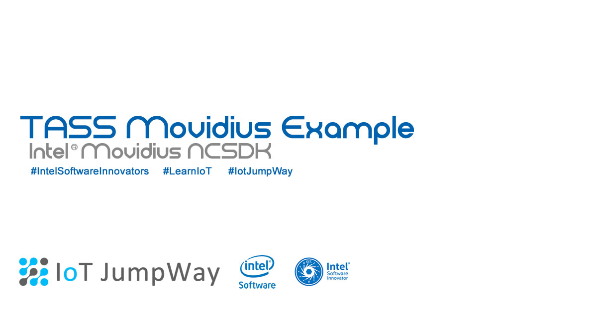
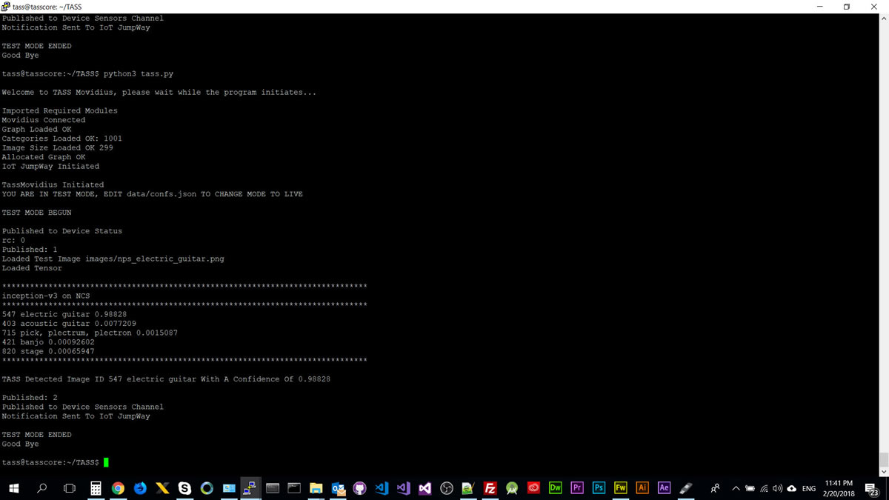
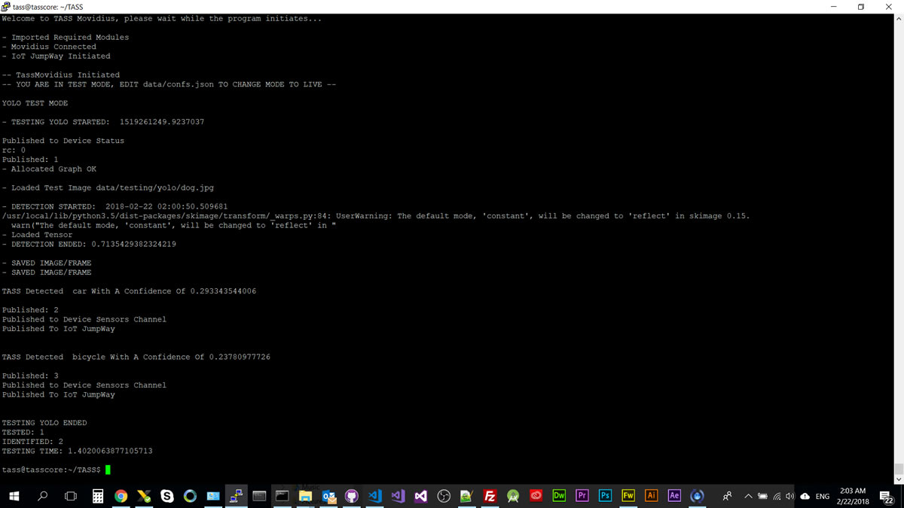
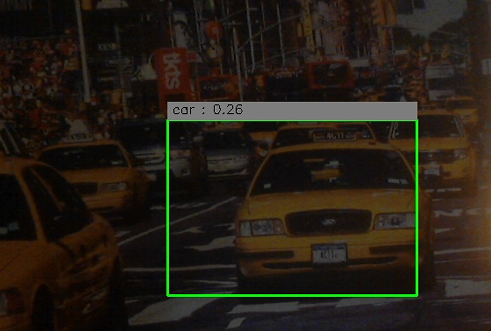
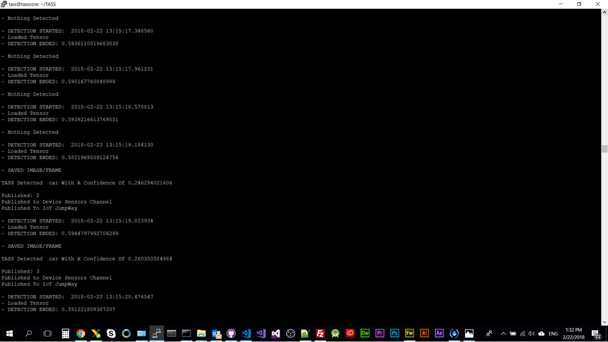
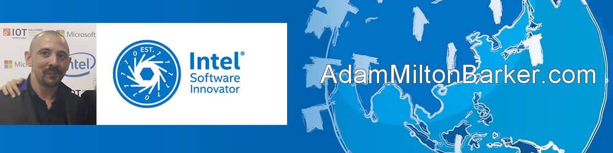

# TASS Movidius Example: IoT Connected Computer Vision



- **Acknowledgement:** Uses code from Intel **movidius/ncsdk** ([movidius/ncsdk Github](https://github.com/movidius/ncsdk "movidius/ncsdk Github"))
- **Acknowledgement:** Uses code from Intel **gudovskiy/yoloNCS** ([gudovskiy/yoloNCS Github](https://github.com/gudovskiy/yoloNCS "gudovskiy/yoloNCS Github"))


## Introduction

TASS Movidius uses pretrained **Inception V3 & Yolo models** and an **Intel® Movidius** to carry out object and **facial classification**, both locally and on a live webcam stream. TASS Movidius uses the [IoT JumpWay](https://iot.techbubbletechnologies.com "IoT JumpWay") for IoT communication and publishes messages to the broker when an object is identified.


## Python Versions

- Tested in Python 3

## Software Requirements

- [Intel® NCSDK](https://github.com/movidius/ncsdk "Intel® NCSDK") 
- [IoT JumpWay MQTT Client](https://github.com/TechBubbleTechnologies/IoT-JumpWay-Python-MQTT-Clients "IoT JumpWay MQTT Client") 

## Hardware Requirements

- Intel® Movidius

This tutorial can be used on a number of devices: 

- Laptop / PC running Ubuntu
- Intel® NUC running Ubuntu / Ubuntu LTS
- Raspberry Pi running Raspian Stretch ([Raspian Stretch](https://www.raspberrypi.org/downloads/raspbian/ "Raspian Stretch") ) 

## Install NCSDK

The first thing you will need to do once you have your operating system on your device is to install the **NCSDK**. 

### Install NCSDK On Raspbery Pi 3:

TO BE CONTINUED 

### Install NCSDK On Other Linux Device:

```
 $ mkdir -p ~/workspace
 $ cd ~/workspace
 $ git clone https://github.com/movidius/ncsdk.git
 $ cd ~/workspace/ncsdk
 $ make install
```

Next plug your Movidius into your device and issue the following commands:

```
 $ cd ~/workspace/ncsdk
 $ make examples
```

## Getting Started With The IoT JumpWay

There are a few tutorials that you should follow before beginning, especially if it is the first time you have used the **IoT JumpWay Developer Program**. If you do not already have one, you will require an **IoT JumpWay Developer Program developer account**, and some basics to be set up before you can start creating your IoT devices. Visit the following [IoT JumpWay Developer Program Docs (5-10 minute read/setup)](https://github.com/TechBubbleTechnologies/IoT-JumpWay-Docs/ "IoT JumpWay Developer Program Docs (5-10 minute read/setup)") and check out the guides that take you through registration and setting up your Location Space, Zones, Devices and Applications (About 5 minutes read).

## Install IoT JumpWay MQTT Client

Next install the IoT JumpWay MQTT Client. For this you can execute the following command:

```
 $ pip3 install techbubbleiotjumpwaymqtt 
```

## IoT JumpWay Device Connection Credentials & Settings

- Setup an IoT JumpWay Location Device for TASS, ensuring you set up you camera node,as you will need the ID of the camera for the project to work. Once your create your device, make sure you note the MQTT username and password, the device ID and device name exactly, you will also need the zone and location ID. You will need to edit your device and add the rules that will allow it to communicate autonomously with the other devices and applications on the network, but for now, these are the only steps that need doing at this point.

Follow the [IoT JumpWay Developer Program (BETA) Location Device Doc](https://github.com/TechBubbleTechnologies/IoT-JumpWay-Docs/blob/master/4-Location-Devices.md "IoT JumpWay Developer Program (BETA) Location Device Doc") to set up your devices.

```
{
    "IoTJumpWay": {
        "Location": YourLocationID,
        "Zone": YourZoneID,
        "Device": YourDeviceID,
        "App": YourAppID
    },
    "IoTJumpWayApp": {
        "Name" : "YourAppName"
    },
    "IoTJumpWayDevice": {
        "Name" : "YourDeviceName"
    },
    "IoTJumpWayMQTT": {
        "Username": "YourMQTTusername",
        "Password": "YourMQTTpassword"
    },
    "Actuators": {},
    "Cameras": [
        {
            "ID": YourCameraID,
            "URL": 0,
            "Name": "YourCameraName"
        }
    ],
    "Sensors": {},
    "ClassifierSettings":{
        "MODE":"YoloTest",
        "NetworkPath":"",
        "InceptionImagePath":"data/testing/inception/",
        "InceptionThreshold": 0.50,
        "YoloImagePath":"data/testing/yolo/",
        "YoloThreshold": 0,
        "Graph":"graph"
    }
}
```

## Cloning The Repo

You will need to clone this repository to a location on your development terminal. Navigate to the directory you would like to download it to and issue the following commands.

    $ git clone https://github.com/TechBubbleTechnologies/IoT-JumpWay-Intel-Examples.git
	
Once you have the repo, you will need to find the files in this folder located in [Intel-Movidius/TASS directory](https://github.com/AdamMiltonBarker/IoT-JumpWay-Intel-Examples/tree/master/Intel-Movidius/TASS "Intel-Movidius/TASS directory"). You will need to navigate to this directory in your terminal also. Execute the following commands:

```
 $ cd IoT-JumpWay-Intel-Examples/Intel-Movidius/TASS
 $ make run
```

This will run ncprofile, nccompile and run:

1. Downloads the TensorFlow checkpoint file.
2. Runs the conversion/save python script to generate network.meta file.
3. Profiles, Compiles and Checks the network using the Neural Compute SDK.

## TASS Movidius Configuration Modes

This tutorial provides a number of configuration modes. For ease, all of the classes and functions that allow the different modes to work have been provided in **tass.py** and **yolo.py**. You are free to create your own projects and modules from these codes. 

- **InceptionTest:** This mode sets the program to classify testing images using Inception V3
- **InceptionLive:** TODO
- **YoloTest:** This mode sets the program to classify testing images using Yolo
- **YoloLive:** This mode sets the program to classify from the live webcam feed using Yolo

## Test Inception V3 Object Recognition

Now that everything is working, you can execute the following command which will start the program in Inception V3 object detection testing mode. To be in test mode you must edit the **ClassifierSettings->MODE** setting in **data/confs.json** to be **InceptionTest**. You can add new images to the testing folder by adding images to **data/testing/inception**.

```
 $ python3 tass.py
```

If all went well, it should of taken about 0.3 seconds to identify each image, and out of the 11 images tested 10 were identified with a confidence higher than 50%, and the whole process should take around 4 or 5 seconds on an Intel® NUC. 



### Intel® NUC

```
- Loaded Test Image data/testing/images/512_InkjetPrinter.jpg

- DETECTION STARTED:  1519248012.519896
- Loaded Tensor
- DETECTION ENDED: 0.3664424419403076

TASS Detected Image ID 743 printer With A Confidence Of 0.97266

Published: 11
Published to Device Sensors Channel
Published To IoT JumpWay

*******************************************************************************
inception-v3 on NCS
*******************************************************************************
743 printer 0.97266
714 photocopier 0.024628
663 modem 0.00094414
733 Polaroid camera, Polaroid Land camera 0.00045657
746 projector 0.00042224
*******************************************************************************
```

```
TESTING ENDED
TESTED: 11
IDENTIFIED: 10
TESTING TIME: 4.594240665435791
```

## Test Yolo Object Recognition

First of all you need to download the weights:

* YOLO_tiny: https://drive.google.com/file/d/0Bzy9LxvTYIgKNFEzOEdaZ3U0Nms/view?usp=sharing

Then compile the graph:

```
 $ mvNCCompile prototxt/yolo_tiny_deploy.prototxt -w weights/yolo_tiny.caffemodel -s 12
```

You can execute the following command which will start the program in Yolo object detection testing mode. To be in Yolo object detection testing mode you must edit the **ClassifierSettings->MODE** setting in **data/confs.json** to be **YoloTest**. You can add new images to the testing folder by adding images to **data/testing/yolo**.

```
 $ python3 tass.py
```

If all went well, it should of taken about 0.7 seconds to identify the car and the bicycle, it does not however identify the dog. The **TESTING TIME** includes the time to publish the notification to the IoT JumpWay, the whole process should take around 1.4 seconds on an Intel® NUC. 



### Intel® NUC

```
- Loaded Test Image data/testing/yolo/dog.jpg

- DETECTION STARTED:  2018-02-22 02:00:50.509681
/usr/local/lib/python3.5/dist-packages/skimage/transform/_warps.py:84: UserWarning: The default mode, 'constant', will be changed to 'reflect' in skimage 0.15.
  warn("The default mode, 'constant', will be changed to 'reflect' in "
- Loaded Tensor
- DETECTION ENDED: 0.7135429382324219

- SAVED IMAGE/FRAME
- SAVED IMAGE/FRAME

TASS Detected  car With A Confidence Of 0.293343544006

Published: 2
Published to Device Sensors Channel
Published To IoT JumpWay


TASS Detected  bicycle With A Confidence Of 0.23780977726

Published: 3
Published to Device Sensors Channel
Published To IoT JumpWay


TESTING YOLO ENDED
TESTED: 1
IDENTIFIED: 2
TESTING TIME: 1.4020063877105713
```

## Live Yolo Object Recognition

First of all make sure your camera is connected and update **data/confs.json** with your sensor information from the IoT JumpWay. You can also point to live stream on an IP cam using the URL field below, leaving it as 0 will connect to the webcam attached to your device. 

```
"Cameras": [
    {
        "ID": YourCameraID,
        "URL": 0,
        "Name": "YourCameraName"
    }
],
```

Next, if you have not already done so by using **YoloTest** mode, you need to download the weights:

* YOLO_tiny: https://drive.google.com/file/d/0Bzy9LxvTYIgKNFEzOEdaZ3U0Nms/view?usp=sharing

Then compile the graph:

```
 $ mvNCCompile prototxt/yolo_tiny_deploy.prototxt -w weights/yolo_tiny.caffemodel -s 12
```

You can execute the following command which will start the program in Yolo object detection live mode. To be in Yolo object detection live mode you must edit the **ClassifierSettings->MODE** setting in **data/confs.json** to be **YoloLive**.

```
 $ python3 tass.py
```



Using a picture with New York Taxis on it, TASS was able to detect a taxi taking about 0.6 seconds to classify the taxi.



```
- DETECTION STARTED:  2018-02-22 13:15:19.184130
- Loaded Tensor
- DETECTION ENDED: 0.5821969509124756

- SAVED IMAGE/FRAME

TASS Detected  car With A Confidence Of 0.246294021606

Published: 2
Published to Device Sensors Channel
Published To IoT JumpWay

- DETECTION STARTED:  2018-02-22 13:15:19.823934
- Loaded Tensor
- DETECTION ENDED: 0.5944797992706299

- SAVED IMAGE/FRAME

TASS Detected  car With A Confidence Of 0.260350584984

Published: 3
Published to Device Sensors Channel
Published To IoT JumpWay
```

## Bugs/Issues

Please feel free to create issues for bugs and general issues you come across whilst using this or any other Intel related IoT JumpWay issues. You may also use the issues area to ask for general help whilst using the IoT JumpWay in your IoT projects.

## Contributors

[](https://github.com/AdamMiltonBarker)

 