# TASS Movidius Example: IoT Connected Computer Vision

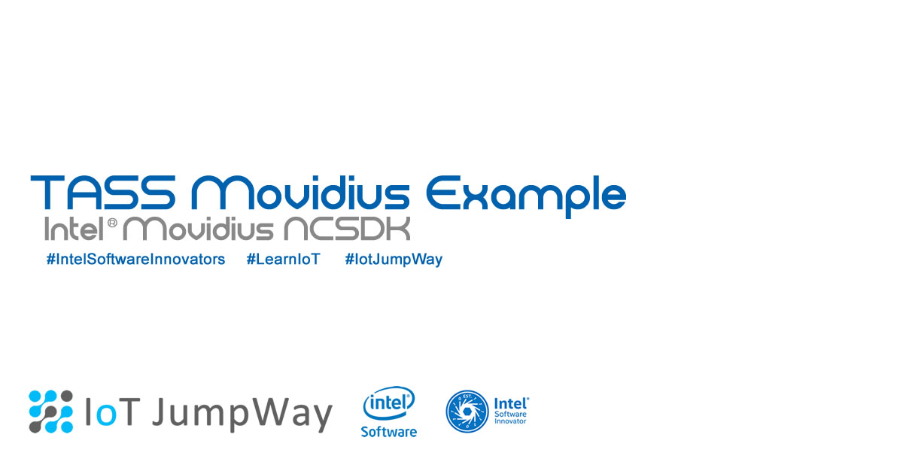


## Introduction

TASS Movidius uses pretrained **Inception V3 & Yolo models** and an **Intel® Movidius** to carry out object and **facial classification**, both locally and on a live webcam stream. TASS Movidius uses the [IoT JumpWay](https://iot.techbubbletechnologies.com "IoT JumpWay") for IoT communication and publishes messages to the broker when an object is identified.

- **Acknowledgement:** Uses code from Intel® **movidius/ncsdk** ([movidius/ncsdk Github](https://github.com/movidius/ncsdk "movidius/ncsdk Github"))
- **Acknowledgement:** Uses code from Intel® **gudovskiy/yoloNCS** ([gudovskiy/yoloNCS Github](https://github.com/gudovskiy/yoloNCS "gudovskiy/yoloNCS Github"))

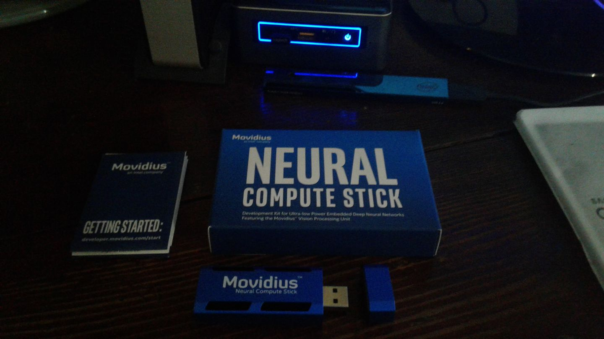

## IoT Devices:

This tutorial will result in two IoT devices:

1. IoT connected computer vision device using a **Raspberry Pi 3** & **Intel® Movidius**.
2. IoT connected alarm system using an **Intel Edison** and an **IoT Dev Kit**. (OPTIONAL)

## What Will We Do?

1. Install the [Intel® NCSDK](https://github.com/movidius/ncsdk "Intel® NCSDK")
2. Install the [IoT JumpWay MQTT Client](https://github.com/TechBubbleTechnologies/IoT-JumpWay-Python-MQTT-Clients "IoT JumpWay MQTT Client") 
3. Clone and set up the repo
4. Test Inception V3 Object Recognition
5. Test Yolo Object Recognition
6. Live Yolo Object Recognition
7. Communication with IoT alarm via rules

## Python Versions

- Tested in Python 3

## Software Requirements

- [Intel® NCSDK](https://github.com/movidius/ncsdk "Intel® NCSDK") 
- [IoT JumpWay MQTT Client](https://github.com/TechBubbleTechnologies/IoT-JumpWay-Python-MQTT-Clients "IoT JumpWay MQTT Client") 

## Hardware Requirements

- Intel® Movidius
- 1 x Webcam / IP cam

This tutorial can be used on a number of devices: 

- Laptop / PC running Ubuntu
- Intel® NUC running Ubuntu / Ubuntu LTS
- Raspberry Pi running Raspian Stretch (16/32gb) ([Raspian Stretch](https://www.raspberrypi.org/downloads/raspbian/ "Raspian Stretch") ) 

If you are completing the full tutorial: 

- 1 x Intel® Edison
- 1x Grove starter kit plus - Intel® IoT Edition for Intel® Edison
- 1 x Blue LED (Grove)
- 1 x Red LED (Grove)
- 1 x Buzzer (Grove)

## Install NCSDK

The first thing you will need to do once you have your operating system on your device is to install the **NCSDK**. 

### Install NCSDK On Raspbery Pi 3:

Make sure you have [Raspian Stretch](https://www.raspberrypi.org/downloads/raspbian/ "Raspian Stretch") installed as the operating system on your Raspberry Pi 3, then continue with the normal install. You will need at least a 16gb SD card on your Raspberry Pi 3.

```
 $ sudo apt-get update && sudo apt-get upgrade
```

```
 $ wget https://github.com/lhelontra/tensorflow-on-arm/releases/download/v1.3.1/tensorflow-1.3.1-cp35-none-linux_armv7l.whl
 $ pip3 install tensorflow-1.3.1-cp35-none-linux_armv7l.whl
```

### Install NCSDK:

```
 $ mkdir -p ~/workspace
 $ cd ~/workspace
 $ git clone https://github.com/movidius/ncsdk.git
 $ cd ~/workspace/ncsdk
 $ make install
```

Next plug your Movidius into your device and issue the following commands, this will take a while if you are installing on a Raspberry Pi 3

```
 $ cd ~/workspace/ncsdk
 $ make examples
```

## Getting Started With The IoT JumpWay

There are a few tutorials that you should follow before beginning, especially if it is the first time you have used the **IoT JumpWay Developer Program**. If you do not already have one, you will require an **IoT JumpWay Developer Program developer account**, and some basics to be set up before you can start creating your IoT devices. Visit the following [IoT JumpWay Developer Program Docs (5-10 minute read/setup)](https://github.com/TechBubbleTechnologies/IoT-JumpWay-Docs/ "IoT JumpWay Developer Program Docs (5-10 minute read/setup)") and check out the guides that take you through registration and setting up your Location Space, Zones, Devices and Applications (About 5 minutes read).

## Install IoT JumpWay MQTT Client

Next install the IoT JumpWay MQTT Client. For this you can execute the following command:

```
 $ pip3 install techbubbleiotjumpwaymqtt 
```

## IoT JumpWay Device Connection Credentials & Settings

- Setup an IoT JumpWay Location Device for TASS, ensuring you set up you camera node,as you will need the ID of the camera for the project to work. Once your create your device, make sure you note the MQTT username and password, the device ID and device name exactly, you will also need the zone and location ID. You will need to edit your device and add the rules that will allow it to communicate autonomously with the other devices and applications on the network, but for now, these are the only steps that need doing at this point.

Follow the [IoT JumpWay Developer Program (BETA) Location Device Doc](https://github.com/TechBubbleTechnologies/IoT-JumpWay-Docs/blob/master/4-Location-Devices.md "IoT JumpWay Developer Program (BETA) Location Device Doc") to set up your devices.

```
{
    "IoTJumpWay": {
        "Location": YourLocationID,
        "Zone": YourZoneID,
        "Device": YourDeviceID,
        "App": YourAppID
    },
    "IoTJumpWayApp": {
        "Name" : "YourAppName"
    },
    "IoTJumpWayDevice": {
        "Name" : "YourDeviceName"
    },
    "IoTJumpWayMQTT": {
        "Username": "YourMQTTusername",
        "Password": "YourMQTTpassword"
    },
    "Actuators": {},
    "Cameras": [
        {
            "ID": YourCameraID,
            "URL": 0,
            "Name": "YourCameraName"
        }
    ],
    "Sensors": {},
    "ClassifierSettings":{
        "MODE":"YoloTest",
        "NetworkPath":"",
        "InceptionImagePath":"data/testing/inception/",
        "InceptionThreshold": 0.50,
        "YoloImagePath":"data/testing/yolo/",
        "YoloThreshold": 0,
        "InceptionGraph":"igraph",
        "YoloGraph":"graph"
    }
}
```

## Cloning The Repo

You will need to clone this repository to a location on your development terminal. Navigate to the directory you would like to download it to and issue the following commands.

    $ git clone https://github.com/TechBubbleTechnologies/IoT-JumpWay-Intel-Examples.git
	
Once you have the repo, you will need to find the files in this folder located in [Intel-Movidius/TASS directory](https://github.com/AdamMiltonBarker/IoT-JumpWay-Intel-Examples/tree/master/Intel-Movidius/TASS "Intel-Movidius/TASS directory"). You will need to navigate to this directory in your terminal also. Execute the following commands:

```
 $ cd IoT-JumpWay-Intel-Examples/Intel-Movidius/TASS
 $ make all
```

This will:

1. Download the TensorFlow checkpoint file.
2. Run the conversion/save python script to generate network.meta file.
3. Profile, Compile and Check the network using the Neural Compute SDK.

Once you have done this you should see a file called **graph**, for this tutorial to work you need to rename this file on your device to **igraph**. This will allow you to switch between the Inception V3 model and the Yolo model without having to recompile the graph every time.

## TASS Movidius Configuration Modes

This tutorial provides a number of configuration modes. For ease, all of the classes and functions that allow the different modes to work have been provided in **tass.py** and **yolo.py**. You are free to create your own projects and modules from these codes. 

- **InceptionTest:** This mode sets the program to classify testing images using Inception V3
- **InceptionLive:** This mode sets the program to classify from the live webcam feed using Inception V3
- **YoloTest:** This mode sets the program to classify testing images using Yolo
- **YoloLive:** This mode sets the program to classify from the live webcam feed using Yolo
- **InceptionFacial:** TODO 

## Test Inception V3 Object Recognition

Now that everything is working, you can execute the following command which will start the program in Inception V3 object detection testing mode. To be in test mode you must edit the **ClassifierSettings->MODE** setting in **data/confs.json** to be **InceptionTest**. You can add new images to the testing folder by adding images to **data/testing/inception**.

```
 $ python3 tass.py
```

### Raspberry Pi 3 Results


Using a Raspberry Pi, it should of taken about 0.3 / 0.4 seconds to classify each image.  Out of the 11 images tested 10 were identified with a confidence higher than 50%, the whole process should take around 4-5 seconds on a Raspberry Pi. **TESTING TIME** includes the time it took to process the 11 images, classify them, and send a notification to the IoT JumpWay for each object identified.

```
- Loaded Test Image data/testing/inception/512_Monitor.jpg

- DETECTION STARTED:  1519415423.247995
- Loaded Tensor
- DETECTION ENDED: 0.4072284698486328

TASS Detected Image ID 783 screen, CRT screen With A Confidence Of 0.5747

Published to Device Sensors Channel
Published To IoT JumpWay

*******************************************************************************
inception-v3 on NCS
*******************************************************************************
783 screen, CRT screen 0.5747
665 monitor 0.2395
Published: 11
528 desktop computer 0.1376
509 computer keyboard, keypad 0.00651
852 television, television system 0.006233
*******************************************************************************
```

```
TESTING INCEPTION V3 ENDED
TESTED: 11
IDENTIFIED: 10
TESTING TIME: 4.765908241271973
```

### Intel® NUC  Results

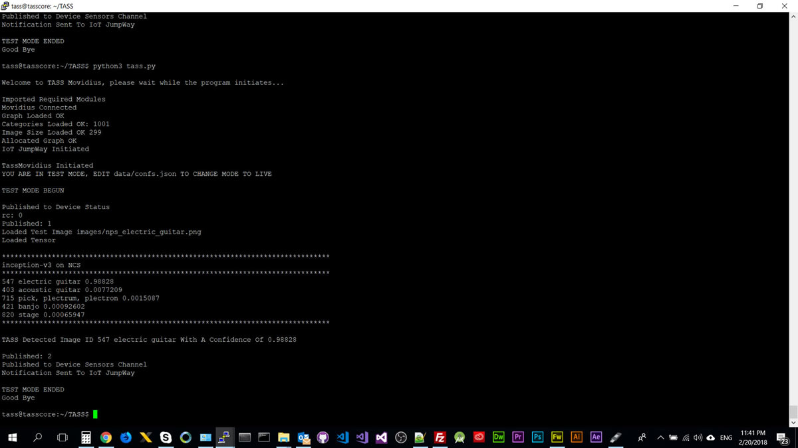

Using a Raspberry Pi, it should of taken about 0.3 seconds to classify each image.  Out of the 11 images tested 10 were identified with a confidence higher than 50%, the whole process should take around 4 or 5 seconds on a Raspberry Pi. **TESTING TIME** includes the time it took to process the 11 images, classify them, and send a notification to the IoT JumpWay for each object identified.

```
- Loaded Test Image data/testing/images/512_InkjetPrinter.jpg

- DETECTION STARTED:  1519248012.519896
- Loaded Tensor
- DETECTION ENDED: 0.3664424419403076

TASS Detected Image ID 743 printer With A Confidence Of 0.97266

Published: 11
Published to Device Sensors Channel
Published To IoT JumpWay

*******************************************************************************
inception-v3 on NCS
*******************************************************************************
743 printer 0.97266
714 photocopier 0.024628
663 modem 0.00094414
733 Polaroid camera, Polaroid Land camera 0.00045657
746 projector 0.00042224
*******************************************************************************
```

```
TESTING ENDED
TESTED: 11
IDENTIFIED: 10
TESTING TIME: 4.594240665435791
```

## Test Yolo Object Recognition

First of all you need to download the weights:

* YOLO_tiny: https://drive.google.com/file/d/0Bzy9LxvTYIgKNFEzOEdaZ3U0Nms/view?usp=sharing

Then compile the graph:

```
 $ mvNCCompile prototxt/yolo_tiny_deploy.prototxt -w weights/yolo_tiny.caffemodel -s 12
```

You can execute the following command which will start the program in Yolo object detection testing mode. To be in Yolo object detection testing mode you must edit the **ClassifierSettings->MODE** setting in **data/confs.json** to be **YoloTest**. You can add new images to the testing folder by adding images to **data/testing/yolo**.

```
 $ python3 tass.py
```

### Raspberry Pi 3 Results

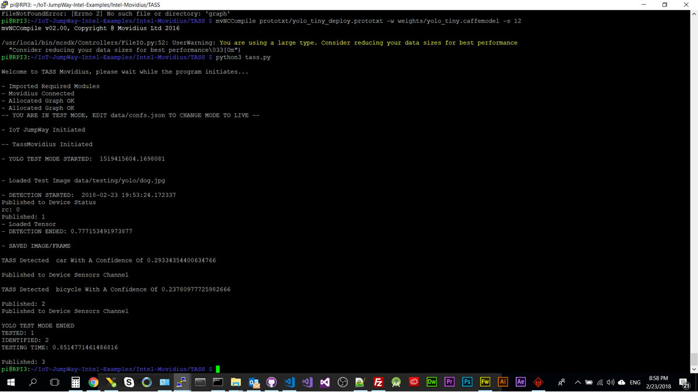

Using a Raspberry Pi, it should of taken about 0.7 seconds to identify the car and the bicycle, it does not however identify the dog. **TESTING TIME** includes the time it took to process the image, classify it, and send a notification to the IoT JumpWay for each object identified.

```
Welcome to TASS Movidius, please wait while the program initiates...

- Imported Required Modules
- Movidius Connected
- Allocated Graph OK
- Allocated Graph OK
-- YOU ARE IN TEST MODE, EDIT data/confs.json TO CHANGE MODE TO LIVE --

- IoT JumpWay Initiated

-- TassMovidius Initiated

- YOLO TEST MODE STARTED:  1519415604.1698081


- Loaded Test Image data/testing/yolo/dog.jpg

- DETECTION STARTED:  2018-02-23 19:53:24.172337
Published to Device Status
rc: 0
Published: 1
- Loaded Tensor
- DETECTION ENDED: 0.777153491973877

- SAVED IMAGE/FRAME

TASS Detected  car With A Confidence Of 0.29334354400634766

Published to Device Sensors Channel

TASS Detected  bicycle With A Confidence Of 0.23780977725982666

Published: 2
Published to Device Sensors Channel
```

```
YOLO TEST MODE ENDED
TESTED: 1
IDENTIFIED: 2
TESTING TIME: 0.8514771461486816
```

### Intel® NUC  Results

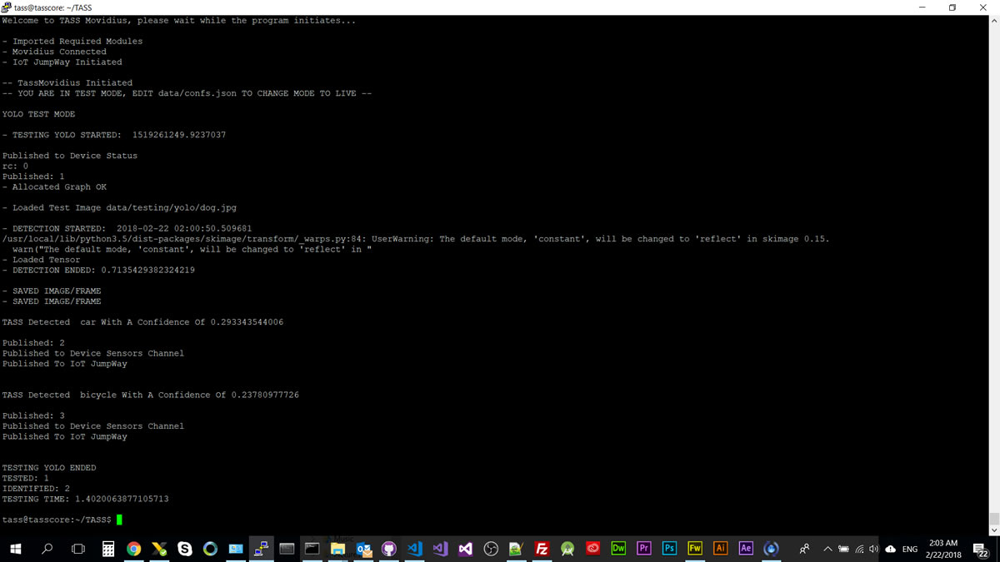

Using a Intel® NUC, it should of taken about 0.7 seconds to identify the car and the bicycle, it does not however identify the dog. **TESTING TIME** includes the time it took to process the image, classify it, and send a notification to the IoT JumpWay for each object identified.

```
- Loaded Test Image data/testing/yolo/dog.jpg

- DETECTION STARTED:  2018-02-22 02:00:50.509681
/usr/local/lib/python3.5/dist-packages/skimage/transform/_warps.py:84: UserWarning: The default mode, 'constant', will be changed to 'reflect' in skimage 0.15.
  warn("The default mode, 'constant', will be changed to 'reflect' in "
- Loaded Tensor
- DETECTION ENDED: 0.7135429382324219

- SAVED IMAGE/FRAME
- SAVED IMAGE/FRAME

TASS Detected  car With A Confidence Of 0.293343544006

Published: 2
Published to Device Sensors Channel
Published To IoT JumpWay


TASS Detected  bicycle With A Confidence Of 0.23780977726

Published: 3
Published to Device Sensors Channel
Published To IoT JumpWay


TESTING YOLO ENDED
TESTED: 1
IDENTIFIED: 2
TESTING TIME: 1.4020063877105713
```

## Live Yolo Object Recognition

First of all make sure your camera is connected and update **data/confs.json** with your sensor information from the IoT JumpWay. You can also point to live stream on an IP cam using the URL field below, leaving it as 0 will connect to the webcam attached to your device. 

```
"Cameras": [
    {
        "ID": YourCameraID,
        "URL": 0,
        "Name": "YourCameraName"
    }
],
```

Next, if you have not already done so by using **YoloTest** mode, you need to download the weights:

* YOLO_tiny: https://drive.google.com/file/d/0Bzy9LxvTYIgKNFEzOEdaZ3U0Nms/view?usp=sharing

Then compile the graph:

```
 $ mvNCCompile prototxt/yolo_tiny_deploy.prototxt -w weights/yolo_tiny.caffemodel -s 12
```

You can execute the following command which will start the program in Yolo object detection live mode. To be in Yolo object detection live mode you must edit the **ClassifierSettings->MODE** setting in **data/confs.json** to be **YoloLive**.

```
 $ python3 tass.py
```

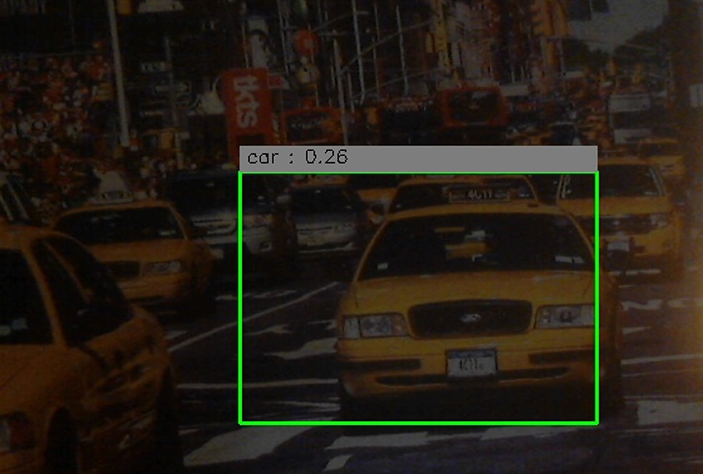

Using a picture with New York Taxis on it, TASS was able to detect a taxi taking about 0.6 seconds to classify the taxi.

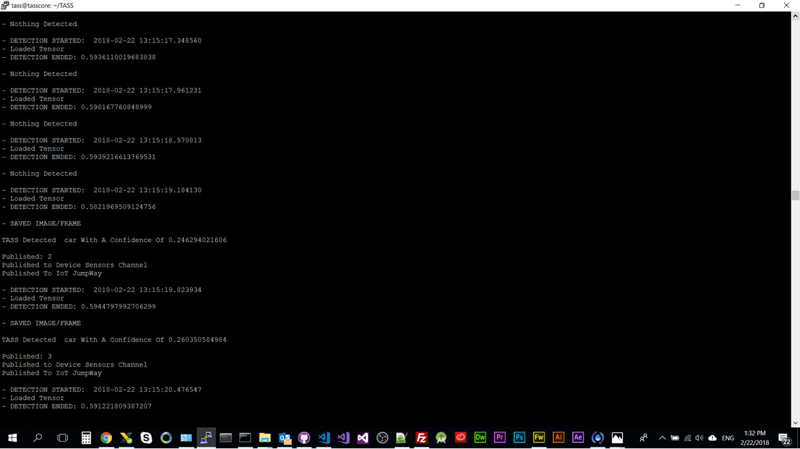

```
- DETECTION STARTED:  2018-02-22 13:15:19.184130
- Loaded Tensor
- DETECTION ENDED: 0.5821969509124756

- SAVED IMAGE/FRAME

TASS Detected  car With A Confidence Of 0.246294021606

Published: 2
Published to Device Sensors Channel
Published To IoT JumpWay

- DETECTION STARTED:  2018-02-22 13:15:19.823934
- Loaded Tensor
- DETECTION ENDED: 0.5944797992706299

- SAVED IMAGE/FRAME

TASS Detected  car With A Confidence Of 0.260350584984

Published: 3
Published to Device Sensors Channel
Published To IoT JumpWay
```

## Setting Up Your Intel® Edison IoT Alarm

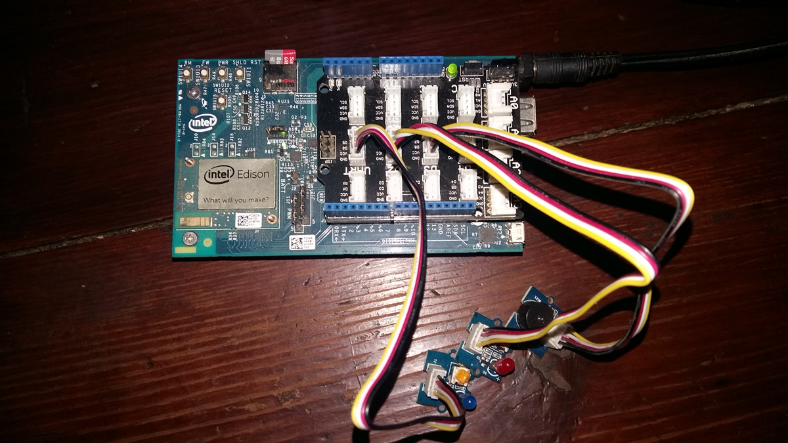

The next step is to set up your Intel® Edison so that TASS can communicate with it via the IoT JumpWay. For this, I already created a tutorial for the IoT JumpWay Intel® Edison Dev Kit IoT Alarm that will guide you through this process. The only difference is that you do not need to set up the Python commands application, as in this project, TASS will replace the Python commands application, to save time, please only follow the steps for the Intel® Edison device Node JS application. 

You will find the tutorial on the following link: 

[IoT JumpWay Intel® Edison Dev Kit IoT Alarm](https://github.com/AdamMiltonBarker/IoT-JumpWay-Intel-Examples/tree/master/Intel-Edison/Dev-Kit-IoT-Alarm/NodeJS "IoT JumpWay Intel® Edison Dev Kit IoT Alarm")

Once you have completed that tutorial and have your device setup, return here to complete the final integration steps.

## Setting Up Your Rules

You are now ready to take the final steps, at this point you should have everything set up and your Intel® Edison Dev Kit IoT Alarm should be running and connected to the IoT JumpWay waiting for instructions. 

Next we are going to set up the rules that allow TASS PVL to control your Intel® Edison Dev Kit IoT Alarm autonomously. Go back to the TAS PVL device page and make sure you are on the edit page. Scroll down to below where you added the camera node and you will see you are able to add rules. 

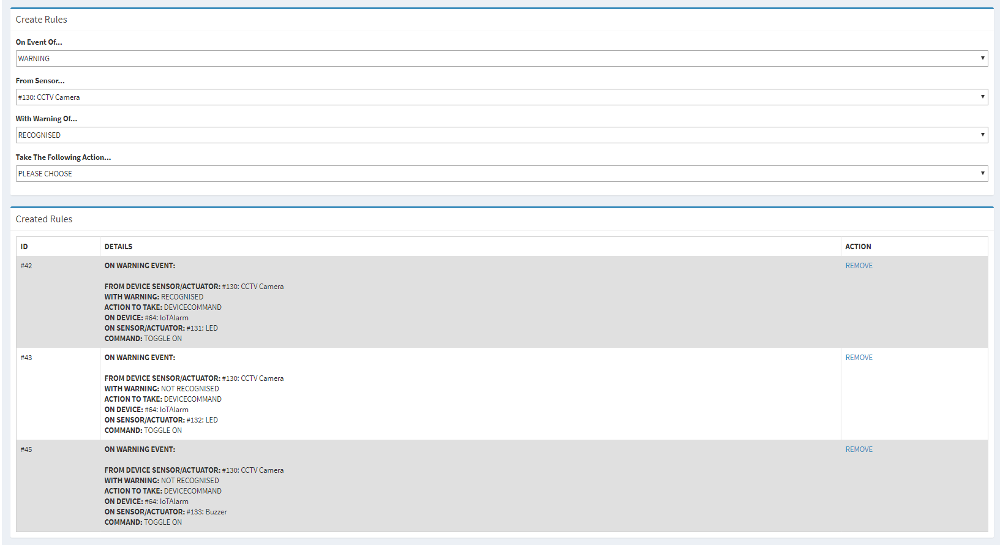

The rules that we want to add are as follows:

1. When an object is identified, turn on the red LED.

3. When an object is identified, turn on the buzzer.

The events are going be triggered by warning messages sent from TASS, so in the On Event Of drop down, select WARNING. Then you need to select the camera node you added to the TASS device, as this is the sensor that the warning will come from. Next choose RECOGNISED in the With Warning Of, which will mean that the rule will be triggered when the IoT JumpWay receives a warning message that an object has been identified, then select the Send Device Command for the Take The Following Action section, choose the Intel® Edison as the device, the red LED as the sensor, toggle as the action and on as the command. This will then tell the Edison to turn on the red light in the event of an object being detected, repeat this process for the buzzer. 

## Seeing What Your Neural Network Sees

In the event that an object is detected with a confidence higher than the threshold, the frame will be saved in the **data/captures** folder, bounding boxes will be drawn around all objects that are detected.

## Viewing Your Data

When the program detects an object, it will send sensor data to the [IoT JumpWay](https://iot.techbubbletechnologies.com/ "IoT JumpWay"). You will be able to access the data in the [IoT JumpWay Developers Area](https://iot.techbubbletechnologies.com/developers/dashboard/ "IoT JumpWay Developers Area"). Once you have logged into the Developers Area, visit the [IoT JumpWay Location Devices Page](https://iot.techbubbletechnologies.com/developers/location-devices "Location Devices page"), find your device and then visit the Sensor Data pages to view the data sent from the device.

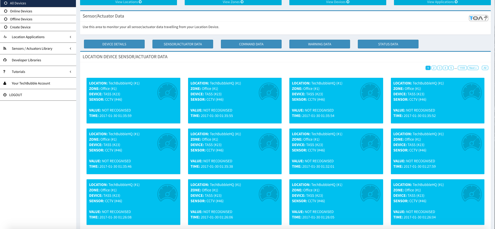

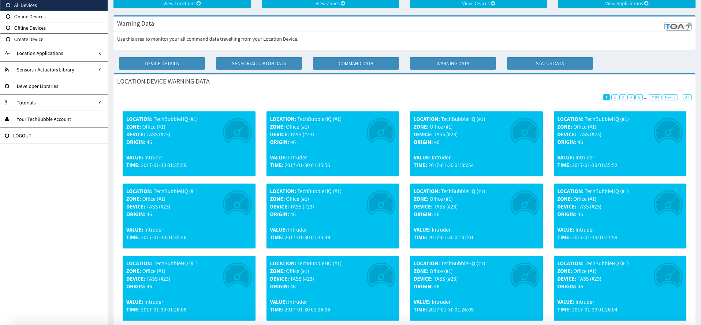

## Bugs/Issues

Please feel free to create issues for bugs and general issues you come across whilst using this or any other Intel® related IoT JumpWay issues. You may also use the issues area to ask for general help whilst using the IoT JumpWay in your IoT projects.

## Contributors

[](https://github.com/AdamMiltonBarker)

 